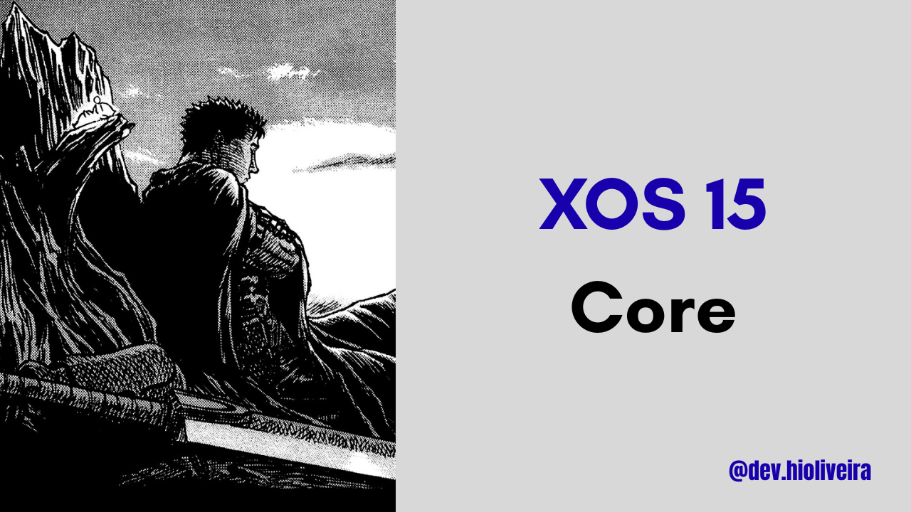

<h1 align="center">📱 XOS Core 15.0.3.127 Stable – Moto G54 5G - Moto G64 5G</h1>

<p align="center">
  
</p>

<p align="center">
  <b>Firmware Required:</b> V1TDS35H.83-20-5-6<br>
  <b>Version:</b> 15.0.3.127 EU Stable<br>
  <b>Base Device:</b> Infinix Note 40 5G<br>
</p>

---

## ✨ Features & Improvements

<details>
<summary><b>Click to expand</b></summary>

### ✔ What’s Working
- Fingerprint sensor
- Bluetooth
- Wi-Fi
- SIM card (calls and mobile data)
- Mobile hotspot
- Display brightness control
- Audio (speaker and microphone)<br>
<b>In short: all core features are fully functional.</b>

### 🚀 Enhancements
- Removed AOD (not needed for IPS panels)
- Added Transsion Flagship (XOS) – credit: @EzerMod
- Flagship Animations Enabled – credit: @EzerMod
- Preferred Network 4G/5G Enabled – credit: @devhioliveira10 made the changes, and @Not_psyco discovered the solution and helped
- Lockscreen Wallpaper Fixed – credit: @devhioliveira10
- Included OrangeFox (OFOX) – credit: @ussr_1674 (Soviet)
- Removed HBM mode (not needed for IPS panels) - credit: @devhioliveira10
- Removed sar support to improve wifi performance – credit: @devhioliveira10
- Removed Blur - credit: @devhioliveira10

## ✨ Features

- ⚡ **XOS Core build** with only essential components, removing heavy and unnecessary apps for better performance and stability
- 🎮 Game Mode with Turbo Mode fully integrated  
- 📦 Extras folder including useful modules and applications  
- 📷 2K camera recording support
- ✅ Play Integrity fix  
- 🧩 Pixel & property spoofing  
- ⚙️ Per-app spoofing manager  
- ☁️ Google Photos unlimited backup  
- 🧰 Payload dumper integration  
- 🎮 Unlock high-FPS modes in games  
- 🧾 Modify application data files safely  
- ⚡ Highly optimized system with excellent performance and stability

</details>

---

## 🐞 Known Bugs
- DT2W / R2W / ST2W *(Moto side)*

---

## 📖 Notes

<details>
  <summary><b>Click to expand</b></summary>

- Always back up your data before flashing. If something goes wrong, it’s better to lose time than lose data — corporate wisdom.

- Many preinstalled apps were removed. This build is a **core/minimal system**, containing only essential applications.  
  You are free to choose what you want to install, as all official Infinix apps are available in the **Extras/Apps Infinix** folder on Google Drive.

- The default Infinix camera is available in the Extras folder on Google Drive.
Both HIOS/XOS stock cameras have lower image quality and are unable to record at 60 FPS due to compatibility limitations.
For the best possible quality and proper 60 FPS recording, it is recommended to use GCam.

- Google Play Store comes **preinstalled by default**.

- To ensure the **integrity system works properly**, please download **KaoriosToolbox.apk** from the **Extras** folder on Google Drive.  
  With Kaorios Toolbox, you can customize several system options — explore at your own risk (and enjoyment).

</details>

---

## 📥 Installation Guide

<details>
<summary><b>Port Flashing</b></summary>

### Method 1: Recovery Installation (Recommended)

> ⚠️ **IMPORTANT:** This port **REQUIRES a custom recovery**.  
> Stock recovery **will NOT work**. If you are not using a custom recovery, **do not even try**.

You must install this port using **one of the supported custom recoveries**:
- **[TWRP](https://drive.google.com/file/d/1bze5K3uk-C6TAVPXHJ0VLOoNIYIx-OLs/view?usp=drive_link)**
- **[OrangeFox (OFOX)](https://drive.google.com/file/d/1guAN3IIYP-t-NAWYXJnsPundINDVaWDf/view?usp=drivesdk)**
- **[PitchBlack Recovery (PBRP)](https://drive.google.com/file/d/1XEPGRTUcHspBFpv5jv2xCs8_LtKhH9L0/view?usp=drivesdk)**

Installation steps:

1. Boot your device into **custom recovery mode** (TWRP / OFOX / PBRP).
2. Perform a **Format Data** to ensure a clean installation.
3. Reboot back into **custom recovery mode**.
4. Copy the **XOS ZIP** to your internal storage.
5. Go to **Install**, select the ZIP file, and **swipe to confirm** the flash.

If you are unable to copy the file to internal storage, you can alternatively use:
- **USB OTG**
- **MicroSD card** (if supported by your device)

---

### Method 2: ADB Sideload (Custom Recovery Required)

ADB Sideload is also supported, but **still requires a custom recovery**:

1. Boot your device into **custom recovery mode**.
2. Navigate to **ADB Sideload**  
   > The location of this option may vary depending on the recovery.  
   > In **TWRP**, go to **Advanced → ADB Sideload**.
3. On your PC terminal, run:
   ```bash
   adb sideload <drag and drop the XOS ZIP here>
   ```
4. Wait for the flashing process to complete, then reboot the system.
</details>

---

## 📡 Credits
Huge thanks to all contributors and supporters:

- @EzerMod – For starting this project  
- @devhioliveira10 (DevHiOliveira) – Performed multiple bug fixes and made XOS stable and solid  
- @ussr_1674 (Soviet) – I will update the XOS Core post.  
- @nyello08 – Added Transsion Flagship (XOS) features and enabled flagship animations
- @Kousei_jp - Thank you for providing the Kaorios Toolbox.
- @ussr_1674 – Thanks you for providing the custom recoveries

❤️ And to the community that helped make XOS a stable and reliable port.
---

## 💬 Support
For issues, discussions, or reports:
Talk to us at 
https://t.me/devhioliveirasupport
https://t.me/MotorolaMotoG54PortsBR/

---

## 📥 Download

### 🔗 XOS Core 15.0.3.127 — EU Stable

- **ROM:**  
  👉 [Download via Google Drive](https://drive.google.com/file/d/1NKk3S6x5oNxG_sGJ-OfSEA2q8fjv8Mvc/view?usp=drive_link)

- **Integrity Check:**  
  🔑 **MD5:** `6EE2BA4AD6399CDB640ED7D966D97EB0`  
  *(Always verify the checksum before flashing.)*

- **Extras:**  
  📦 [Extras Folder](https://drive.google.com/drive/folders/1LqG-oSlsYm3cQ1vj0d_rR9cssBiPocjl)  

---
